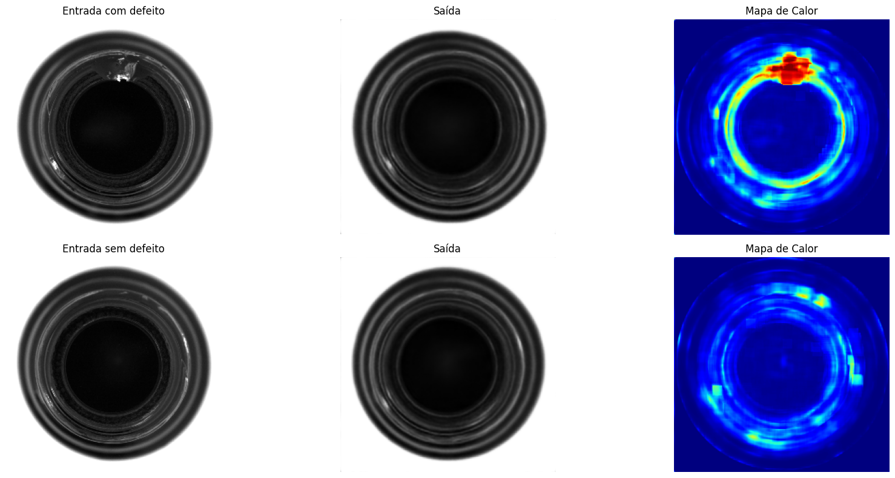

<div align="center">

# Detecção de Anomalias Visuais com Autoencoder Convolucional e Perda Híbrida no Dataset MVTec AD

----------

[]()
[]()
[]()

----------

<div align="left">

## Introdução

Este projeto apresenta uma implementação simples de um Autoencoder Convolucional para detecção de anomalias visuais em imagens industriais do dataset MVTec AD. O modelo é treinado de forma não supervisionada usando imagens sem defeitos e emprega uma função de perda híbrida que combina Erro Quadrático Médio (MSE) e Índice de Similaridade Estrutural (SSIM), visando melhorar a sensibilidade à detecção de defeitos.

## Dataset

O dataset MVTec AD contém imagens de 15 categorias diferentes de produtos industriais com e sem defeitos. Este projeto foca na categoria \textit{bottle}, que possui imagens de alta resolução com defeitos variados, como \textit{broken\_large}, \textit{broken\_small} e \textit{contamination}.

### Estrutura de Diretórios

As imagens devem estar organizadas conforme a estrutura abaixo na pasta `/content/drive/MyDrive/Autoencoder_MVTecAD/mvtec`:

<pre> ```text bottle ├── train │ └── good └── test ├── broken_large ├── broken_small ├── contamination └── good ``` </pre>

## Dependências

As principais bibliotecas utilizadas neste projeto são:

* `tensorflow >= 2.18`  (para construção e treinamento do modelo, incluindo cálculo SSIM)
* `numpy >= 2.0`        (manipulação e processamento de arrays)
* `matplotlib`          (visualização de resultados)
* `opencv-python`       (carregamento e pré-processamento das imagens)

## Resultados

<div align="center">





</div>

## Licença

Este projeto está licenciado sob a licença MIT - veja o arquivo LICENSE para detalhes.

## Referências

* https://github.com/ViniciusTavaresSousa/Deteccao-de-Anomalias-Visuais-com-Autoencoder-Convolucional-e-Perda-Hibrida-no-Dataset-MVTec-AD  

</div>

